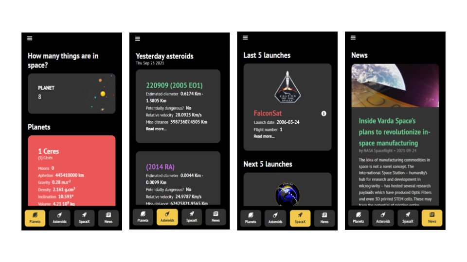

# 🚀 Welcome to Space! 🌎
Are you ready? Join us in this adventure through space. 
Project developed for the subject of programming language at the Faculdade de Tecnologia Termomecanica, where you will be able to learn more about space.

> If you want the android apk, you can find it at the preview folder as **app-debug.apk**



## 🏁 To use the application

### Install dependencies
```
$ cordova platform add browser
```

### Start application
```
$ cordova run browser
```


## 📱 To build the APK

```
$ cordova platform add android
```

```
$ cordova plugin rm org.apache.cordova.console --save
```

```
$ cordova build --prod android
```

## 🔗 APIs
- [The Solar System OpenData](https://api.le-systeme-solaire.net/en/)
- [Nasa Asteroids NeoWs](https://api.nasa.gov)
- [SpaceX](https://github.com/r-spacex/SpaceX-API)
- [Spaceflight News](https://api.spaceflightnewsapi.net/v3/documentation#)

## 💻 Technologies
- HTML
- CSS
- JavaScript
- Cordova
- Bootstrap

## 👥 Developers
[ <br> <sub> Isabelle Okuma </sub>](https://github.com/isabelleokuma) | [ <br> <sub> Laura Bento </sub>](https://github.com/laurabento) | [ <br> <sub> Maria Akamine </sub>](https://github.com/mariagabs) | [ <br> <sub> Raphael Konichi </sub>](https://github.com/raphaelkonichi) |
| :---: | :---: | :---: | :---: | 
